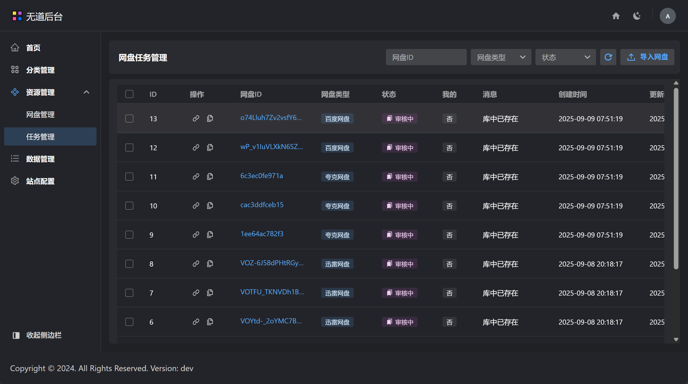

# PanSearch - 网盘搜索引擎

  
  
  

  <strong>🚀 高性能网盘资源搜索引擎，让海量资源触手可及</strong>

## 📖 简介

PanSearch 是一款基于 Go + React 开发的现代化网盘搜索引擎，专为高效管理和搜索网盘资源而设计。通过先进的全文搜索技术和智能分类算法，帮助用户快速定位所需资源。

### ✨ 核心优势

- **🎯 精准搜索** - 基于 Elasticsearch 的全文搜索，支持模糊匹配和智能推荐
- **⚡ 高性能** - Go 语言后端，处理大量数据游刃有余
- **🌐 现代界面** - React 构建的响应式 Web 界面，用户体验优秀
- **🔌 易扩展** - RESTful API 设计，支持二次开发

## 🚀 功能特性

### 📁 多网盘支持

- **百度网盘** - 完整支持资源索引和搜索
- **阿里云盘** - 高速搜索和资源管理
- **夸克网盘** - 智能分类和标签管理
- **迅雷网盘** - 批量操作和资源同步
- **更多网盘** - 持续扩展支持

### 🔍 智能搜索

- **全文搜索** - 基于 Elasticsearch 的高性能搜索引擎
- **模糊匹配** - 智能纠错和相似度匹配
- **高级筛选** - 支持文件类型、大小、时间等多维度筛选
- **搜索建议** - 实时搜索建议和热门关键词

<!-- ### 📊 资源管理 -->

<!-- - **智能分类** - 自动识别文件类型并分类
- **标签系统** - 自定义标签管理和批量标记
- **收藏夹** - 个人收藏和分享功能
- **统计分析** - 资源使用情况和趋势分析 -->

### 🔧 技术特性

- **RESTful API** - 完整的 API 接口文档
- **响应式设计** - 适配多种设备和屏幕尺寸
<!-- - **实时更新** - WebSocket 实时数据同步 -->
- **缓存优化** - Redis 缓存提升响应速度

## 📥 快速开始

### 下载安装

**下载预编译版本**（推荐）

前往 [Releases 页面](https://github.com/Xwudao/go-pansearch-release/releases) 下载最新版本的二进制文件：

## 📚 文档

详细使用或安装教程，参考：

[https://docs.hunhepan.com/pansearch/](https://docs.hunhepan.com/pansearch/)

## 📱 截图

_主界面 - 简洁现代的搜索界面_

  
_搜索结果 - 丰富的筛选和排序选项_

_资源详情 - 详细的文件信息和操作_

_设置页面 - 灵活的配置选项_

_任务界面 - 实时入库状态_

## 🤝 贡献

我们欢迎所有形式的贡献！

- 🐛 提交 Bug 报告
- 💡 提出新功能建议
- 📝 改进文档
- 🔧 提交代码

## 🙋‍♂️ 联系我们

如有问题或建议，请：

- 提交 [Issue](https://github.com/Xwudao/go-pansearch-release/issues)
- 发送邮件至：contact@hunhepan.com

---

  <strong>⭐ 如果这个项目对您有帮助，请给我们一个 Star！</strong>

